# Evidence README

---

## 1. RBAC + Gatekeeper

### 1.1. ArgoCD / controller health

```bash
kubectl get applications -n argocd
kubectl get pods -n gatekeeper-system
```

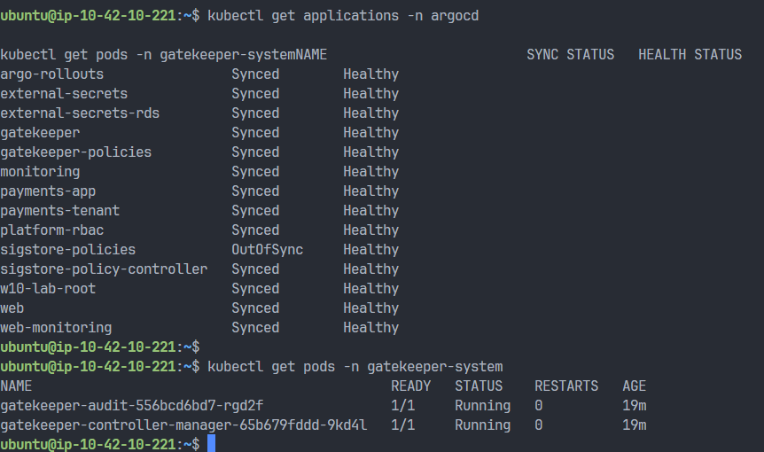

### 1.2. RBAC impersonation

```bash
kubectl auth can-i create deployments --as=alice -n demo
kubectl auth can-i get secrets --as=alice -n demo
kubectl auth can-i get secrets --as=bob -n demo
kubectl auth can-i create deployments --as=carol -n demo
```

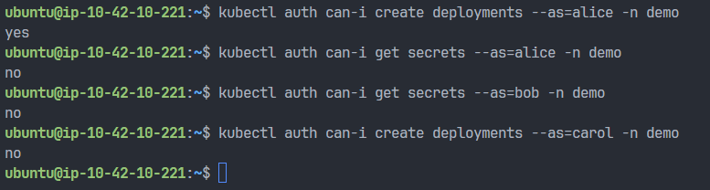

### 1.3. Gatekeeper constraints

```bash
kubectl get constrainttemplates
kubectl get k8sdisallowedtags
kubectl get k8srequiredresources
kubectl get k8spspallowedusers
kubectl get k8spsphostnetworkingports
kubectl get k8smaxdeploymentreplicas
kubectl get k8smaxdeploymentreplicas max-deployment-replicas -o yaml
```

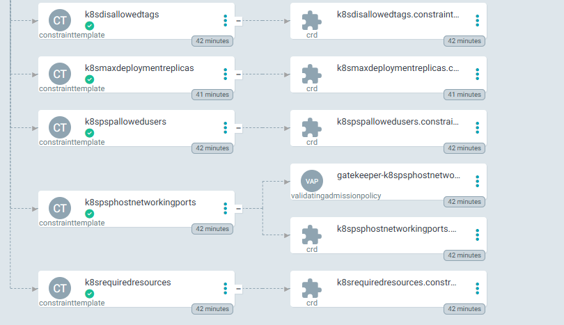

### 1.4. 4 case bị reject

```bash
kubectl apply -f w10-gitops-repo/evidence/day-a/bad-latest.yaml
kubectl apply -f w10-gitops-repo/evidence/day-a/bad-no-limits.yaml
kubectl apply -f w10-gitops-repo/evidence/day-a/bad-root.yaml
kubectl apply -f w10-gitops-repo/evidence/day-a/bad-hostnetwork.yaml
```

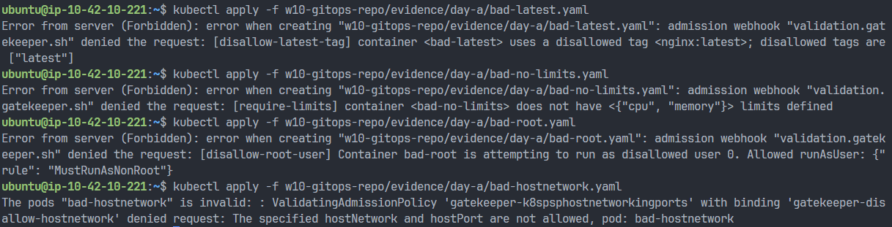

#### `w10-gitops/evidence/day-a/bad-latest.yaml`

```yaml
apiVersion: v1
kind: Pod
metadata:
  name: bad-latest
  namespace: demo
spec:
  restartPolicy: Never
  securityContext:
    runAsNonRoot: true
    runAsUser: 1000
    seccompProfile:
      type: RuntimeDefault
  containers:
    - name: bad-latest
      image: nginx:latest
      command: ["sh", "-c", "sleep 3600"]
      securityContext:
        runAsNonRoot: true
        allowPrivilegeEscalation: false
        readOnlyRootFilesystem: true
        capabilities:
          drop: ["ALL"]
      resources:
        requests:
          cpu: 50m
          memory: 64Mi
        limits:
          cpu: 200m
          memory: 128Mi
```

#### `w10-gitops/evidence/day-a/bad-no-limits.yaml`

```yaml
apiVersion: v1
kind: Pod
metadata:
  name: bad-no-limits
  namespace: demo
spec:
  restartPolicy: Never
  securityContext:
    runAsNonRoot: true
    runAsUser: 1000
    seccompProfile:
      type: RuntimeDefault
  containers:
    - name: bad-no-limits
      image: nginx:1.27.0
      command: ["sh", "-c", "sleep 3600"]
      securityContext:
        runAsNonRoot: true
        allowPrivilegeEscalation: false
        readOnlyRootFilesystem: true
        capabilities:
          drop: ["ALL"]
```

#### `w10-gitops/evidence/day-a/bad-root.yaml`

```yaml
apiVersion: v1
kind: Pod
metadata:
  name: bad-root
  namespace: demo
spec:
  restartPolicy: Never
  securityContext:
    runAsUser: 0
    seccompProfile:
      type: RuntimeDefault
  containers:
    - name: bad-root
      image: nginx:1.27.0
      command: ["sh", "-c", "sleep 3600"]
      securityContext:
        allowPrivilegeEscalation: false
        readOnlyRootFilesystem: true
        capabilities:
          drop: ["ALL"]
      resources:
        requests:
          cpu: 50m
          memory: 64Mi
        limits:
          cpu: 200m
          memory: 128Mi
```

#### `w10-gitops/evidence/day-a/bad-hostnetwork.yaml`

```yaml
apiVersion: v1
kind: Pod
metadata:
  name: bad-hostnetwork
  namespace: demo
spec:
  hostNetwork: true
  restartPolicy: Never
  securityContext:
    runAsNonRoot: true
    runAsUser: 1000
    seccompProfile:
      type: RuntimeDefault
  containers:
    - name: bad-hostnetwork
      image: nginx:1.27.0
      command: ["sh", "-c", "sleep 3600"]
      securityContext:
        runAsNonRoot: true
        allowPrivilegeEscalation: false
        readOnlyRootFilesystem: true
        capabilities:
          drop: ["ALL"]
      resources:
        requests:
          cpu: 50m
          memory: 64Mi
        limits:
          cpu: 200m
          memory: 128Mi
```

### 1.5. 1 manifest hợp lệ pass

```bash
kubectl apply -f w10-gitops-repo/evidence/day-a/good-pod.yaml
kubectl get pod -n demo
```

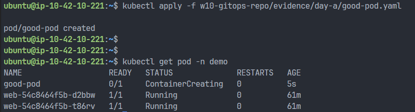

#### `w10-gitops/evidence/day-a/good-pod.yaml`

```yaml
apiVersion: v1
kind: Pod
metadata:
  name: good-pod
  namespace: demo
spec:
  restartPolicy: Never
  securityContext:
    runAsNonRoot: true
    runAsUser: 1000
    seccompProfile:
      type: RuntimeDefault
  containers:
    - name: good-pod
      image: nginx:1.27.0
      command: ["sh", "-c", "sleep 3600"]
      securityContext:
        runAsNonRoot: true
        allowPrivilegeEscalation: false
        readOnlyRootFilesystem: true
        capabilities:
          drop: ["ALL"]
      resources:
        requests:
          cpu: 50m
          memory: 64Mi
        limits:
          cpu: 200m
          memory: 128Mi
```

### 1.6. Custom policy fail / pass

```bash
kubectl apply -f w10-gitops-repo/evidence/day-a/deployment-replicas-6.yaml
kubectl apply -f w10-gitops-repo/evidence/day-a/deployment-replicas-3.yaml
```

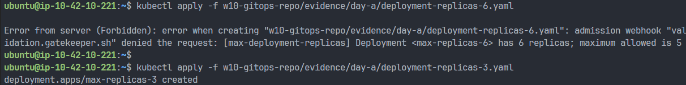

#### `w10-gitops/evidence/day-a/deployment-replicas-6.yaml`

```yaml
apiVersion: apps/v1
kind: Deployment
metadata:
  name: max-replicas-6
  namespace: demo
spec:
  replicas: 6
  selector:
    matchLabels:
      app: max-replicas-6
  template:
    metadata:
      labels:
        app: max-replicas-6
    spec:
      securityContext:
        runAsNonRoot: true
        runAsUser: 1000
        seccompProfile:
          type: RuntimeDefault
      containers:
        - name: web
          image: nginx:1.27.0
          command: ["sh", "-c", "sleep 3600"]
          securityContext:
            runAsNonRoot: true
            allowPrivilegeEscalation: false
            readOnlyRootFilesystem: true
            capabilities:
              drop: ["ALL"]
          resources:
            requests:
              cpu: 50m
              memory: 64Mi
            limits:
              cpu: 200m
              memory: 128Mi
```

#### `w10-gitops/evidence/day-a/deployment-replicas-3.yaml`

```yaml
apiVersion: apps/v1
kind: Deployment
metadata:
  name: max-replicas-3
  namespace: demo
spec:
  replicas: 3
  selector:
    matchLabels:
      app: max-replicas-3
  template:
    metadata:
      labels:
        app: max-replicas-3
    spec:
      securityContext:
        runAsNonRoot: true
        runAsUser: 1000
        seccompProfile:
          type: RuntimeDefault
      containers:
        - name: web
          image: nginx:1.27.0
          command: ["sh", "-c", "sleep 3600"]
          securityContext:
            runAsNonRoot: true
            allowPrivilegeEscalation: false
            readOnlyRootFilesystem: true
            capabilities:
              drop: ["ALL"]
          resources:
            requests:
              cpu: 50m
              memory: 64Mi
            limits:
              cpu: 200m
              memory: 128Mi
```

---

## 2. External Secrets + Supply Chain

### 2.1. Controller health

```bash
kubectl get pods -n external-secrets
kubectl get pods -n cosign-system
```

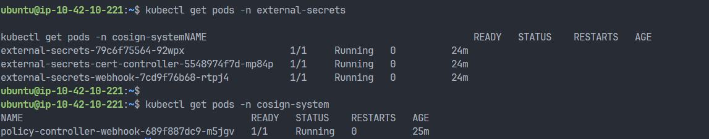

### 2.2. ExternalSecret ready

```bash
kubectl get secretstore,externalsecret -n demo
kubectl describe externalsecret web-db-secret -n demo
```

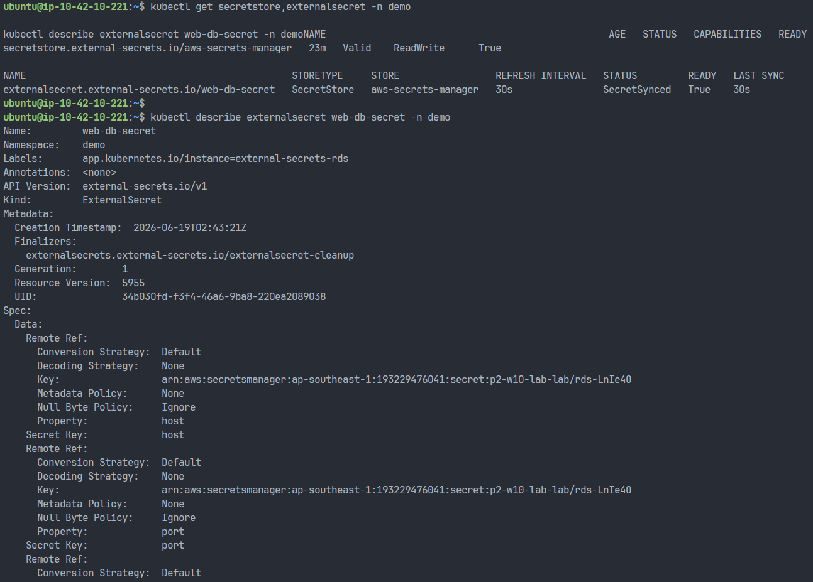

### 2.3. Rotate secret

#### Trước khi rotate

```bash
date -u +"%Y-%m-%dT%H:%M:%SZ"
kubectl get secret web-db-secret -n demo -o jsonpath='{.data.host}' | base64 -d && echo
pod=$(kubectl get pod -n demo -l app.kubernetes.io/name=web -o jsonpath='{.items[0].metadata.name}')
kubectl get pod "$pod" -n demo -o jsonpath='{.status.containerStatuses[0].restartCount}' && echo
curl -s http://localhost:30080/api/db/health
```

#### Rotate ở source

```bash
aws secretsmanager put-secret-value --secret-id arn:aws:secretsmanager:ap-southeast-1:193229476041:secret:p2-w10-lab-lab/rds-LnIe4O --secret-string '{"username":"postgres","password":"matkhaucuatao","host":"p2-w10-lab-lab-postgres.cry8o64cwzj7.ap-southeast-1.rds.amazonaws.com","port":5432,"dbname":"postgres"}'
```

### Trigger rotate 

```bash
kubectl annotate externalsecret web-db-secret -n demo force-sync=$(date +%s) --overwrite
```

#### Sau khi rotate

```bash
date -u +"%Y-%m-%dT%H:%M:%SZ"
kubectl get secret web-db-secret -n demo -o jsonpath='{.data.host}' | base64 -d && echo
kubectl get pod "$pod" -n demo -o jsonpath='{.status.containerStatuses[0].restartCount}' && echo
curl -s http://localhost:30080/api/db/health
```

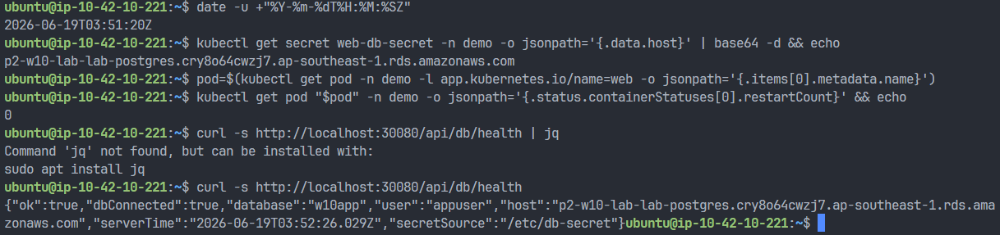
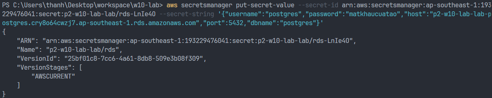
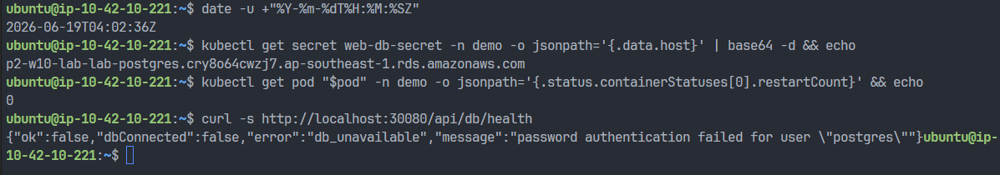

### 2.4. Trivy fail proof

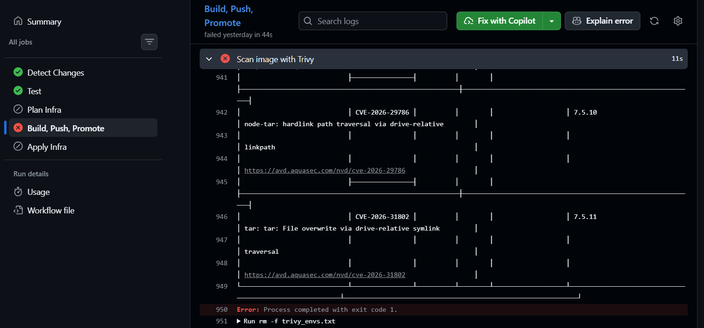

### 2.5. Cosign sign / verify

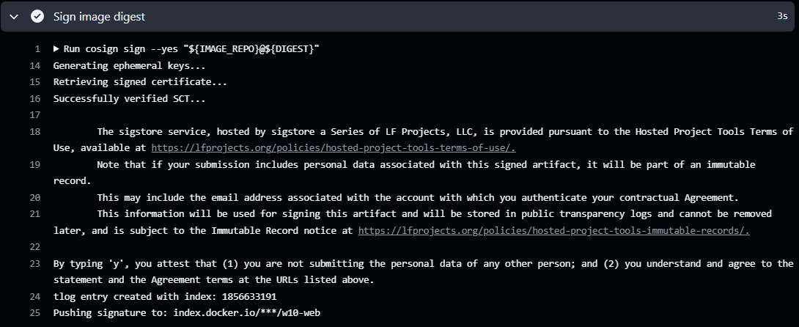
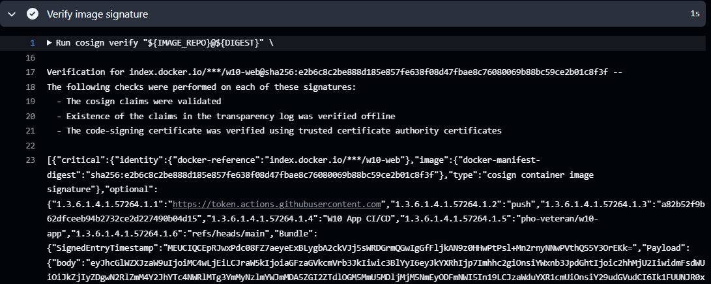

### 2.6. ClusterImagePolicy

```bash
kubectl get clusterimagepolicy require-signed-w10-web -o yaml
```

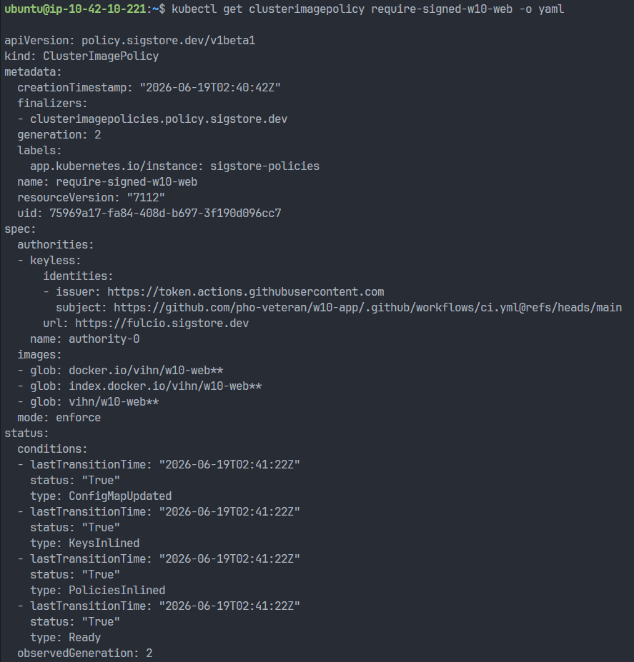

### 2.7. Unsigned image bị chặn

```bash
kubectl -n payments run curl --image=curlimages/curl:8.10.1 --rm -it --restart=Never -- sh
```

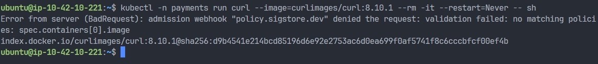

### 2.9. Signed workload pass

```bash
kubectl argo rollouts get rollout web -n demo
kubectl get pods -n demo
```

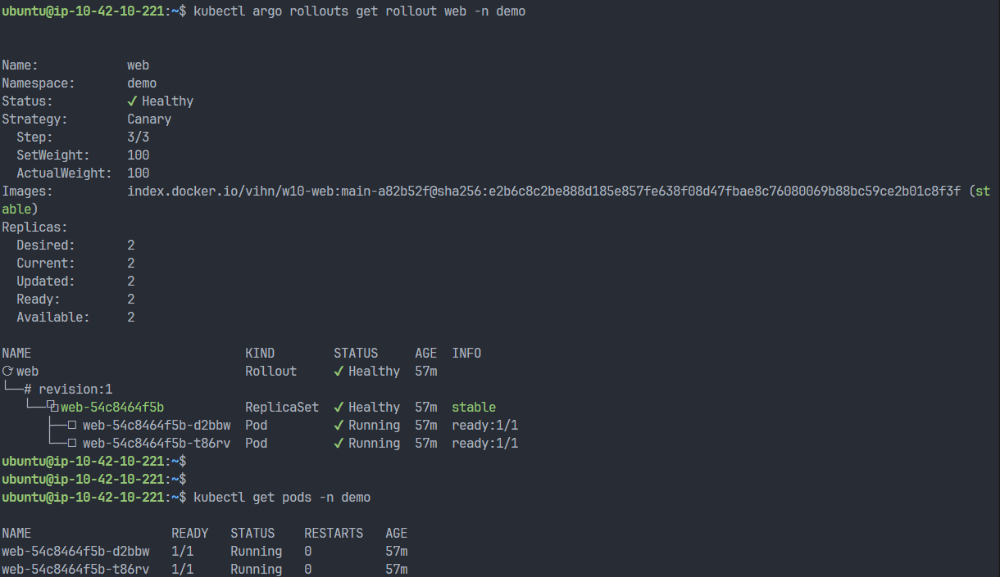

---

## 3. Payments

### 3.1. Tenant sync + labels

```bash
kubectl get applications -n argocd
kubectl get ns payments --show-labels
```
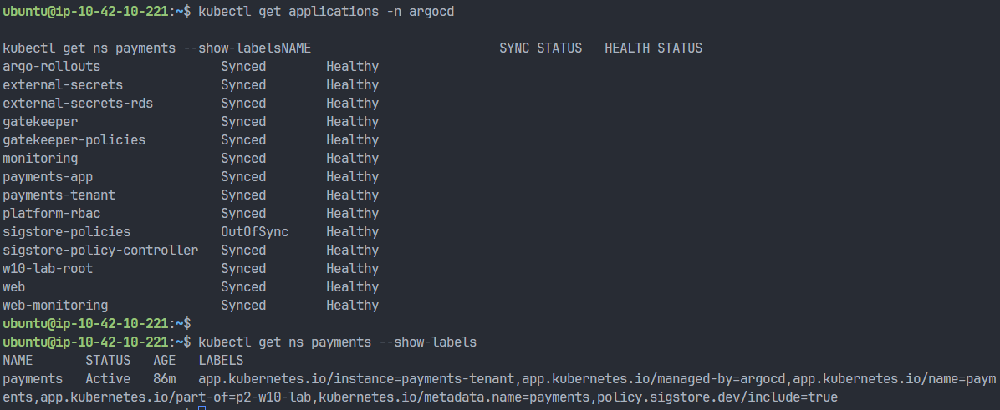

### 3.2. RBAC least-privilege

```bash
kubectl auth can-i create deployments -n payments --as=payments-dev
kubectl auth can-i create deployments -n demo --as=payments-dev
kubectl auth can-i get secrets -n payments --as=payments-dev
kubectl auth can-i create rolebindings -n payments --as=payments-dev
```

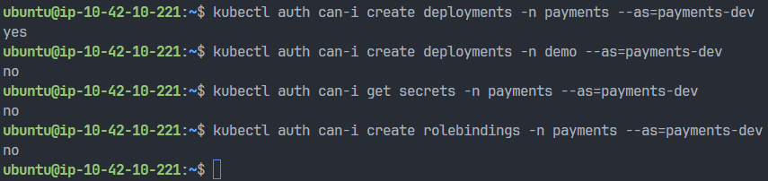

### 3.3. Quota reject

```bash
IMG=$(kubectl -n payments get deploy payments-api -o jsonpath='{.spec.template.spec.containers[0].image}')
echo $IMG

kubectl -n payments apply -f - <<EOF
apiVersion: v1
kind: Pod
metadata:
  name: payments-quota-reject-demo
spec:
  restartPolicy: Never
  securityContext:
    runAsNonRoot: true
    runAsUser: 1000
    runAsGroup: 1000
    seccompProfile:
      type: RuntimeDefault
  containers:
    - name: app
      image: $IMG
      command: ["sh", "-c", "sleep 3600"]
      securityContext:
        runAsNonRoot: true
        allowPrivilegeEscalation: false
        readOnlyRootFilesystem: true
        capabilities:
          drop: ["ALL"]
      resources:
        requests:
          cpu: "2"
          memory: 2Gi
        limits:
          cpu: "2"
          memory: 2Gi
EOF
```

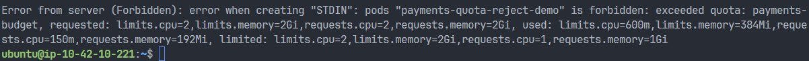

### 3.4. LimitRange default inject

```bash
IMG=$(kubectl -n payments get deploy payments-api -o jsonpath='{.spec.template.spec.containers[0].image}')
echo $IMG

kubectl -n payments apply -f - <<EOF
apiVersion: v1
kind: Pod
metadata:
  name: payments-lr-default-demo
spec:
  restartPolicy: Never
  securityContext:
    runAsNonRoot: true
    runAsUser: 1000
    runAsGroup: 1000
    seccompProfile:
      type: RuntimeDefault
  containers:
    - name: app
      image: $IMG
      command: ["sh", "-c", "sleep 3600"]
      securityContext:
        runAsNonRoot: true
        allowPrivilegeEscalation: false
        readOnlyRootFilesystem: true
        capabilities:
          drop: ["ALL"]
EOF

kubectl -n payments get pod payments-lr-default-demo -o jsonpath='{.spec.containers[0].resources}'
kubectl -n payments delete pod payments-lr-default-demo
```

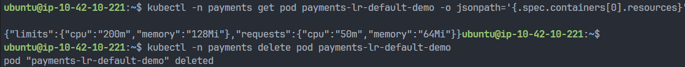

### 3.5. NetworkPolicy

```bash
IMG=$(kubectl -n payments get deploy payments-api -o jsonpath='{.spec.template.spec.containers[0].image}')

kubectl -n payments apply -f - <<EOF
apiVersion: v1
kind: Pod
metadata:
  name: netpol-debug
spec:
  restartPolicy: Never
  securityContext:
    runAsNonRoot: true
    runAsUser: 1000
    runAsGroup: 1000
    seccompProfile:
      type: RuntimeDefault
  containers:
    - name: netpol-debug
      image: $IMG
      command: ["sh", "-c", "sleep 3600"]
      securityContext:
        runAsNonRoot: true
        allowPrivilegeEscalation: false
        readOnlyRootFilesystem: true
        capabilities:
          drop: ["ALL"]
      resources:
        requests:
          cpu: 50m
          memory: 64Mi
        limits:
          cpu: 200m
          memory: 128Mi
EOF

kubectl -n payments exec -it netpol-debug -- sh
```

Trong shell:

```bash
node -e "const http=require('http'); const req=http.get('http://web.demo.svc.cluster.local/api/health', r=>{console.log('STATUS',r.statusCode); r.resume();}); req.setTimeout(3000,()=>{console.log('TIMEOUT/BLOCKED'); req.destroy();}); req.on('error',e=>console.log('ERROR',e.code||e.message));"

node -e "const http=require('http'); const req=http.get('http://payments-api.payments.svc.cluster.local/api/health', r=>{console.log('STATUS',r.statusCode); r.on('data',d=>process.stdout.write(d));}); req.setTimeout(3000,()=>{console.log('TIMEOUT'); req.destroy();}); req.on('error',e=>console.log('ERROR',e.code||e.message));"
```

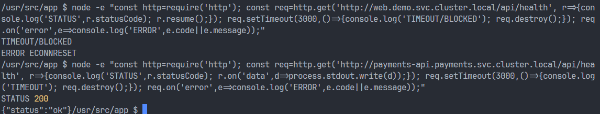

### 3.6. Constraint inherited

```bash
kubectl apply -f w10-gitops-repo/evidence/payments/bad-latest.yaml
```

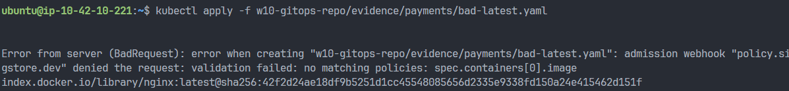

#### `w10-gitops/evidence/payments/bad-latest.yaml`

```yaml
apiVersion: v1
kind: Pod
metadata:
  name: bad-latest
  namespace: payments
spec:
  restartPolicy: Never
  securityContext:
    runAsNonRoot: true
    runAsUser: 1000
    seccompProfile:
      type: RuntimeDefault
  containers:
    - name: bad-latest
      image: nginx:latest
      command: ["sh", "-c", "sleep 3600"]
      securityContext:
        runAsNonRoot: true
        allowPrivilegeEscalation: false
        readOnlyRootFilesystem: true
        capabilities:
          drop: ["ALL"]
      resources:
        requests:
          cpu: 50m
          memory: 64Mi
        limits:
          cpu: 200m
          memory: 128Mi
```

### 3.7. App health

```bash
kubectl -n payments get deploy payments-api
kubectl -n payments get pods
kubectl -n payments get svc payments-api
```

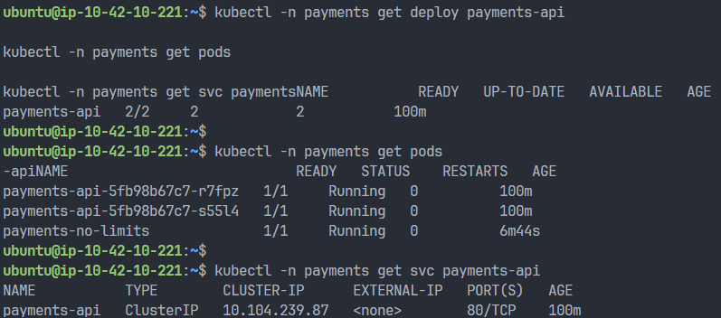

---

## 4. Câu hỏi

### 4.1. Vì sao guardrail cũ tự áp cho team B?

Vì ngay từ đầu em không buộc constraint vào riêng namespace `demo` mà chọn theo label `app.kubernetes.io/part-of=p2-w10-lab`. Namespace `payments` cũng có đúng label đó, nên lúc team B được onboard thì bộ guardrail cũ tự áp vào, không cần viết thêm policy riêng cho `payments`.

### 4.2. Role/RoleBinding khác ClusterRoleBinding thế nào?

`Role` với `RoleBinding` chỉ có hiệu lực trong một namespace, nên em dùng cách này để giữ quyền của `payments-dev` nằm trong `payments`. Nghĩa là team đó deploy được trong namespace của họ, nhưng không đụng sang `demo` hay namespace khác. Còn `ClusterRoleBinding` thì phạm vi quyền rộng hơn. Nếu dùng không kỹ thì rất dễ làm mất tính cô lập giữa các tenants.
